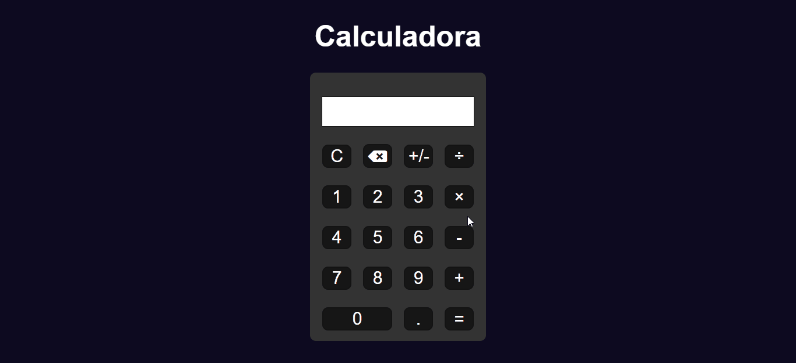

# Calculadora JS

Acesse o projeto <a href="https://jonathanrianelli.github.io/calculadora-js/">aqui</a>

## Descrição

Projeto criado por mim, Fiz com a intenção de praticar meu JavaScript

## Linguagens Usadas
- ✔️ HTML
- ✔️ CSS
- ✔️ JavaScript

## Layout 
### Desktop:

